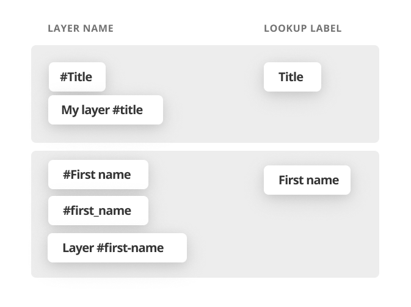
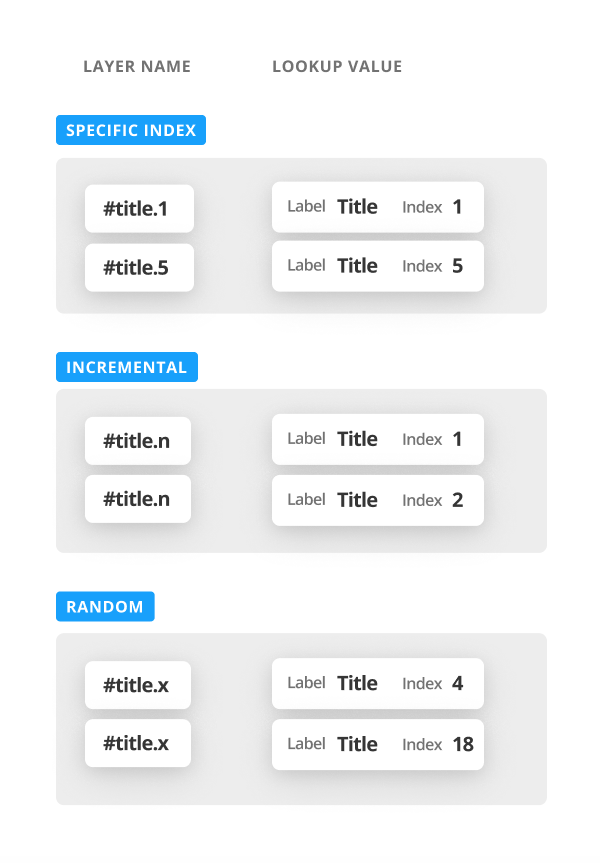
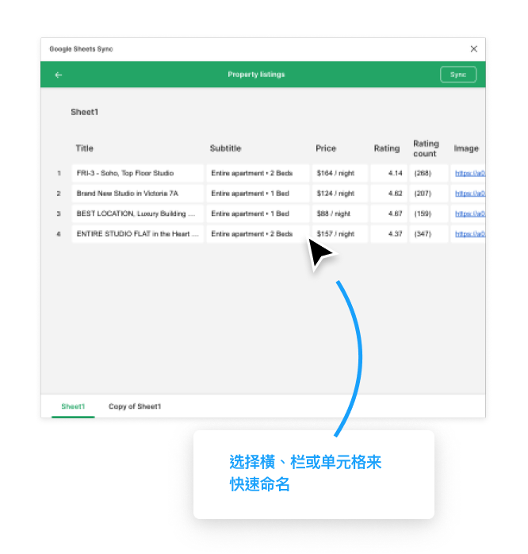
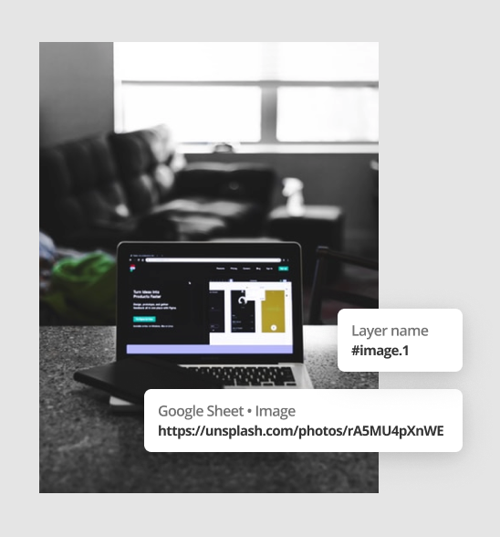
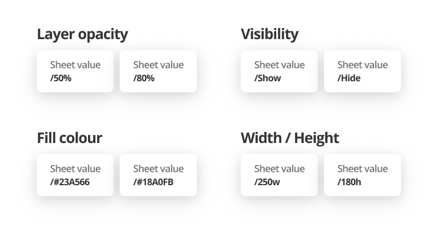

# Google Sheets Sync 如何使用（By David Williames）

## 快速使用

### 1.获取用于共享的链接

在你想要同步的 Google Sheets (Google 表格) 文件里，选择右上角的 '共享'，接着选择 '获取用于共享的链接'。

> 注意：共享必须要设置为知道此链接的人都可以查看 —— 如果共享权限设置的是仅你公司的 G-Suite 可访问，那么这个共享链接可能就不起作用了。

### 2.给图层命名

**一切都取决与你如何给图层命名。** 这个插件是通过合适的命名，来知道该同步哪些内容到图层的。（这个在下方 '给图层命名' 部分详细说明）

### 3.运行插件

- 打开 'Google Sheets Sync' 插件
- 粘贴 '用于共享的链接'
- 最后点击 'Fetch & sync'

## 命名方式

对于你想要使用数据的图层，命名的时候在你想要**同步的值的名字**前面添加一个 '#'。

比如：你想获取 'Title' 这个值，就给你的图层取名为 '#Title'。

> 注意：不区分大小写，而且会忽略空格、下划线和中横线。所以，如果你有个数据叫 'First name'，那么你命名为 'First name', 'first_name', 'layer #first-name', 'firstName' 效果都是一样的。这对于有偏好的命名格式的小伙伴还是挺友好的。

## 表格方向

默认情况下，在读取一个 Google 表格时，会去查找不同列顶部的所有‘关键词’（即查找标签 lookup label）。

但是如果你想获取一个横向表格的关键词，要确保每个标题标签要加粗，这样就可以使表格的第一列变为关键词。

## 查询特定的行或列

你可以通过恰当地给你的图层命名，来指定同步特定的行列查找标签(lookup label)上的内容。

在图层名后面添加 '.1' 会返回该标签下的第一个值，添加 '.2' 会返回第二个，以此类推。

如果要返回递增的值，则添加 '.n'。

如果要返回随机的值，则添加 '.x'。

> 注意：默认情况下，在同一个查找标签下，会一个接一个地返回该标签下的值，这和在图层名后添加 '.n' 效果是一样的。

你可以将索引添加到组、Frame 或者 Component instance 上 —— 所有的子图层都会继承这个索引。如果一个图层有自己的索引，那么则会覆盖它父级的。

## 查询指定的工作表

要查询 Google Sheets 文件内的指定工作表，和给图层命名一样给 Figma Pages 命名就可以了，不过要把 '#' 换成 '//'。

例如：如果你的 Figma Page 名字是 "Page 1 // Properties", 那么这个页面里的所有数据就会查询 Google 表格里名字为 "Properties" 的工作表。

> 注意：默认就会查询 Google 表格文件内的第一个工作表。

你还可以像给 Page 起名字一样给 Frame 或组起名 —— 之后它所有的子图层就会根据这个 Frame 或 组的名字来引用工作表。

## 通过 "Fetch" 协助命名

为了帮助你更快地给图层命名，在同步 Google 表格之前，你可以先点一下插件的 'Fetch' 按钮，而不是'Fetch & sync'。

这样会先展示出表格中的所有内容，以及底部的各个工作表。

### 更快地给你的图层命名

- 选择 ‘Fetch’，获取你的 Google 表格内容
- 选择你想要重命名的图层
- 选择你想要重命名图层的横、栏或单元格 —— 当你鼠标悬停在上面时会先出现一个工具提示来提示你重命名的图层名

> 你还可以点击工作表的名字来给你当前的 Figma Page 重命名。

## 同步图片

在 Figma 里同步图片和同步文字非常类似。如果你 Google 表格里的数据值是一个图片链接地址，同时有 Figma 形状引用了那个值，那么这个图片就会被下载下来作为该图层的形状的填充。

> 注意：下载大图片会需要点时间

## 不同的数据类型

根据你命名的 Figma 图层的类型，和 Google 表格里的值 相结合，我们可以在图层上做一些非常 Cool 的东西出来。

### 组件

要动态地设置一个 Component instance (给一个不同的 master component)，可以将 Google 表格里的值，设置为你要使用的 master component 名字。

不过现在，你需要确保 Master component 在你的 Figma 文件内，现在还不支持 Team Library 的 Component。

## 忽略图层

给图层添加一个 '-' 前缀，那么在同步时就会忽略它还有它的子图层。

## 同步 Master components

大多数情况下，你可能都不会想要同步 Master component（因为这样会搞乱它的 instance），所以默认情况下， Google 表格会忽略掉它。

不过你仍然想要同步 Master component，那么在它的图层名前添加一个 '+'。