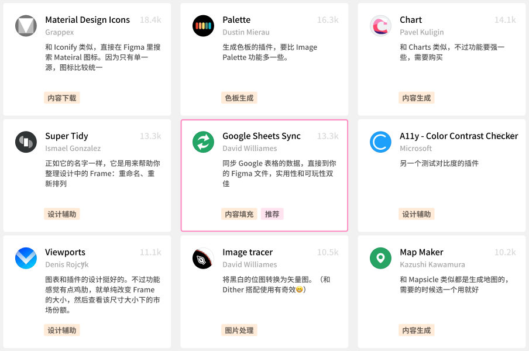

# Figma插件介绍 —— Google Sheets Sync

## 前言

几个月前 Figma 发布了插件功能（2019年8月29日正式发布）。现在 Figma 插件商店里已经有一百多款插件了。我花了一个晚上按照排名体验了一大半，还有一半打算再抽时间简单用一下。

然后我在体验的过程中，就觉得要不做一下体验笔记算了，所以我给每个用过的插件写了个简短的测评/介绍，而且对于其中个人觉得质量比较好的标了星，可以着重看看下图中 Featured 一栏，写着 /show 的是我觉得比较有用的（过几天我整理好之后会把这个表格也分享出来）。

这么多插件中，我最喜欢的一款是 Google Sheets Sync 这个插件，也是本文的主角了。

## 插件简介

先简单介绍一下这款插件的作用。Google Sheets Sync 正如它的名字说的一样，它的作用是将 Google 表格中的数据同步到 Figma 设计中去。

## 它的使用场景是什么呢？

现在 Figma 插件商城里有很多内容填充的插件了，但是因为它们基本上都是英语母语的人开发的，数据源都是英文的，所以对我们来说这些插件并不友好，基本上可以放弃了。

那么如果用 Google Sheet Sync ，我们就可以自定义一些数据内容来使用，比如我目前就做了 3 个例子，一个是中文人名的假数据，一个是一些常用 App 的数据，还有一个是我前面说到的 Figma 插件体验笔记的数据。你也可以根据需要来设计属于你自己的表格。

## 开始使用！！！

扯远了，下面开始快速介绍一下 Google Sheets Sync 插件的使用方式！

### 1.创建 Google 表格

对于这个表格的创建没有太多的要求，你只需要创建你需要的数据类型就可以了，比如你需要人名，那么就创建一个人名栏，其他的文本内容比如地址，也是一样的道理；如果你需要头像，那么就创建一个头像栏，需要注意的是，图片类型需要使用图片链接，而不是直接在表格里边放图片。要获取图片链接的话，你可以将你想要的图片上传到一些图床上来获取图片链接。我这边选用的是将图片放到 Github 上来获取图片链接，所以可以看到表格中图片的链接到是 github 域下的。关于图床我就不展开讲了。

还有另一个需要注意的是，表格的头部需要取好名字，因为等会同步到 Figma 中的时候，就去根据表头中的名字来识别该表格栏中的值的。

在创建了表格之后，获取表格的共享链接，并复制链接。

### 2.给 Figma 的图层命好名字

如果想同步表格中的名字，需要在 Figma 中取好相对应的图层名字。对于这个插件来说，命好名字至关重要！比如下图中，我创建了一个简单的 Component，给每一个图层取了与 Google 表格中相应的名字，然后复制了几个 instance：

### 3.运行插件，同步数据

在 Figma 中打开 'Google Sheets Sync' 这个插件，然后将刚才第一步里复制的链接粘贴进去，然后点击 'Fetch & sync' 就完事了。

接着你会看到 Google 表格中的数据已经被同步了下来：

对于其他表格也是一样的，比如下面是我做的另一个例子，首先是表格：

接着是 Figma 中同步了表格的数据：

## 最后多说几句

需要说明一下的是，关于插件的使用方法，插件作者的文档里已经说得很清楚了，我这边只是介绍一些基本的用法。如果想要详细地了解这个插件，稍后可以去插件主页去看看文档，有许多高阶的用法。

实际上我也对官方的英文文档进行了翻译，如果需要的话可以看看中文文档。我做了一个 [Figma Prototype](https://www.figma.com/proto/9YZkD4xQHtX6yuoeOxickK/tovi_data?node-id=123%3A1683&viewport=670%2C477%2C0.17195431888103485&scaling=min-zoom) 将中文文档、英文文档和前面的两个 Google 表格放了进去，需要的话可以去获取一下。

